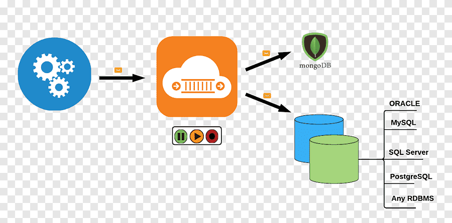
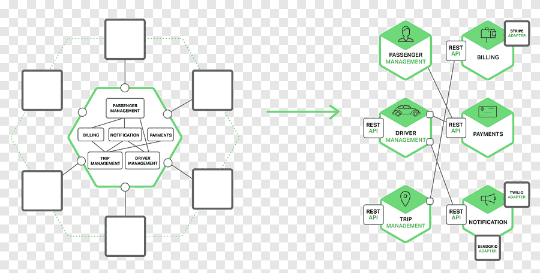

# Custom-Blog-Website

## Acknowledgments

The written content in this project was generated with the assistance of [ChatGPT by OpenAI](https://www.openai.com/chatgpt). **However, all HTML and CSS code was authored independently.**

## Images References

- **Image 1**:  - Source: [GeeksforGeeks](https://www.geeksforgeeks.org/layered-architecture-in-computer-networks/)

- **Image 2**:  - Source: [PNGEGG](https://www.pngegg.com/en/png-sjshy)

- **Image 3**:  - Source: [PNGEGG](https://www.pngegg.com/en/search?q=eventdriven+Architecture)

- **Image 4**:  - Source: [LinkedIn](https://www.linkedin.com/pulse/microkernel-architecture-jos%C3%A9-cruz/)

- **Image 5**:  - Source: [PNGEGG](https://www.pngegg.com/en/png-npbpf)

- **Image 6**:  - Source: [Gigaspaces](https://www.gigaspaces.com/blog/space-based-data-hub)

